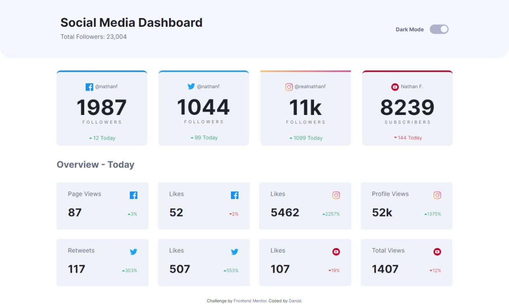

# Frontend Mentor - Social media dashboard with theme switcher

This is a solution to the [Social media dashboard with theme switcher on Frontend Mentor](https://www.frontendmentor.io/challenges/social-media-dashboard-with-theme-switcher-6oY8ozp_H/hub/social-media-dashboard-with-theme-switcher-sVOWoqwmM). Frontend Mentor challenges help you improve your coding skills by building realistic projects. 

# Table of contents

- [Overview](#overview)
  - [Screenshot](#screenshot)
  - [Links](#links)
- [My process](#my-process)
  - [Built with](#built-with)
  - [What I learned](#what-i-learned)
  - [Useful resources](#useful-resources)
- [Author](#author)

## Overview

### Screenshot




### Links

- Repository URL: <https://github.com/danielashjari/dark-light-mode-toggle>
- Live Site URL: <https://danielashjari.github.io/dark-light-mode-toggle/>

## My process

### Built with

- HTML5 
- SCSS
- JS


### What I learned

In this challenge I mostly worked on my SCSS and JS, how to enable dark mode, automate with gulp and set root elements for dark mode.
For example:

```scss
    :root{
      --bg:hsl(0, 0%, 100%);
      --top-bg: hsl(225, 100%, 98%);
    }

    .dark-mode{
      --bg: hsl(230, 17%, 14%);
      --top-bg: hsl(232, 19%, 15%);
    }

```

```JS
    function checkMode() {
        if (checkbox.checked) {
            darkModeOn();
        } else {
            darkModeOff();
        }
    }

    function darkModeOn() {
        document.body.classList.add('dark-mode');
    }

    function darkModeOff() {
        document.body.classList.remove('dark-mode');
    }
```


### Useful resources

- [Codercoder](https://www.youtube.com/c/TheCoderCoder) - This helped me to organize my files, automate and use sass

- [Brian Maina](https://dev.to/mainakibe/easy-guide-to-dark-mode-toggle-using-html-css-and-javascript-35ec) This is a limk to his dark mode toggle project on dev.to where you can find his codepen link fpr the same project.


## Author

- Frontend Mentor - [@danielashjari](https://www.frontendmentor.io/profile/danielashjari)


